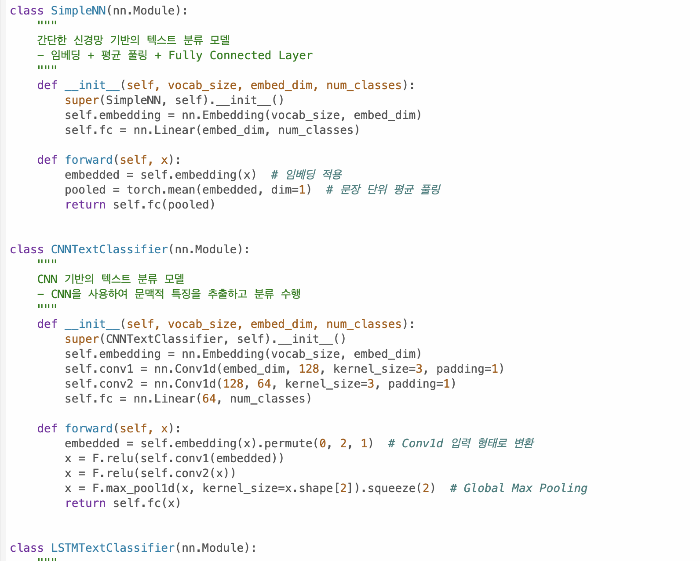
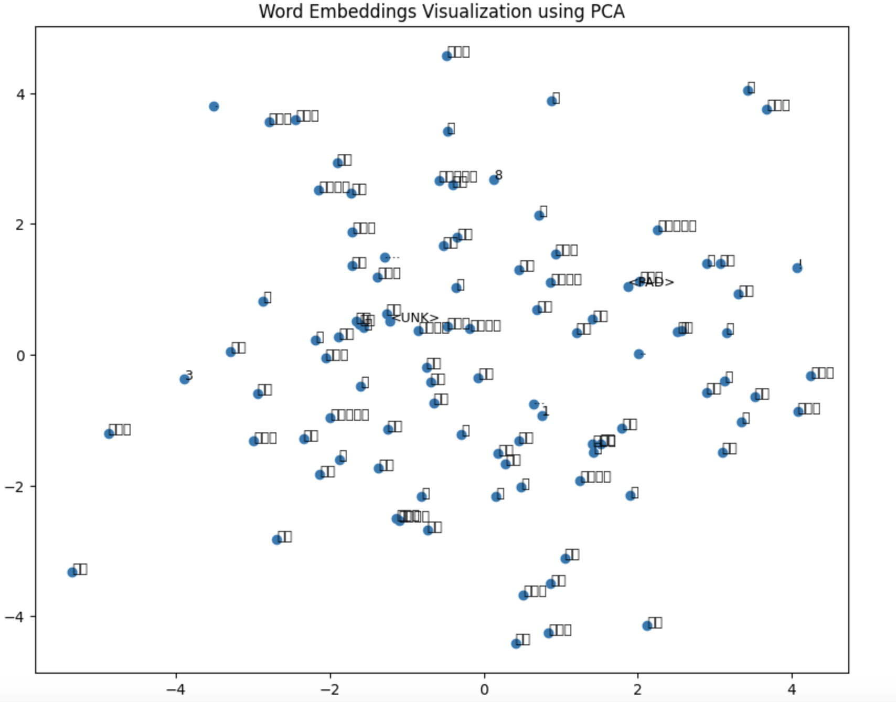
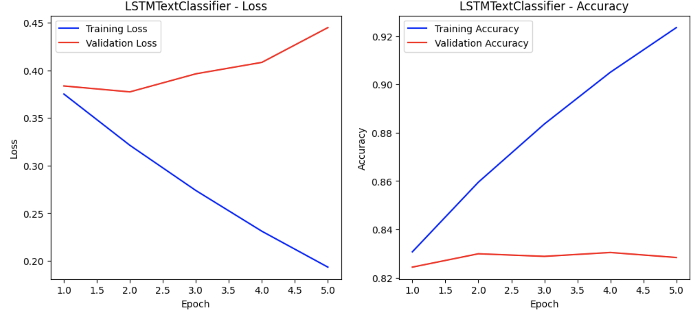
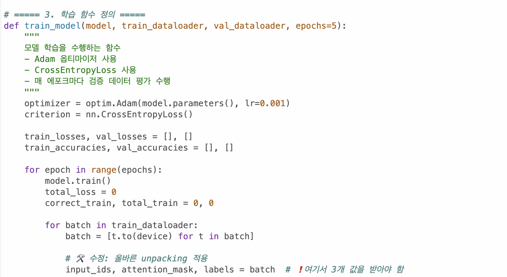
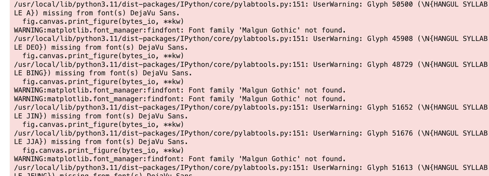
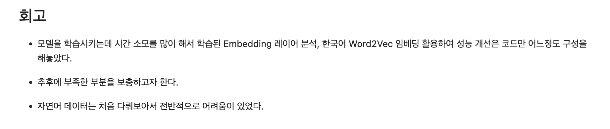

# Exploration - Ex05
# AIFFEL Campus Online Code Peer Review Templete
- 코더 : 이 지안
- 리뷰어 : 김 영만

# PRT(Peer Review Template)
- [*]  **1. 주어진 문제를 해결하는 완성된 코드가 제출되었나요?**
    - 3가지 이상의 모델이 성공적으로 시도 하였습니다.
        -  
    - gensim을 활용하여 자체학습된 혹은 사전학습된 임베딩 레이어를 분석하였습니다.
        -      
    - 한국어 Word2Vec을 활용하여 가시적인 성능향상을 달성했다.
        -  
- [*]  **2. 전체 코드에서 가장 핵심적이거나 가장 복잡하고 이해하기 어려운 부분에 작성된 
주석 또는 doc string을 보고 해당 코드가 잘 이해되었나요?**
    -  다양한 모델을 훈련 할 수 있도록 함수화 시켜 이해가 잘 되었습니다.
        -  
- [*]  **3. 에러가 난 부분을 디버깅하여 문제를 해결한 기록을 남겼거나
새로운 시도 또는 추가 실험을 수행해봤나요?**
    - 한글 임베딩 분석관련하여 문자 문제로 깨져 보이는 부분을 언급 하여 도움이 되었습니다.
        - 
        
- [*]  **4. 회고를 잘 작성했나요?**
    - 환경이나 처음 해 보는 부분에 대해 언급이 잘 되어 있습니다.
         - 
        
- [ ]  **5. 코드가 간결하고 효율적인가요?**
    - 파이썬 스타일 가이드 (PEP8) 를 준수하였는지 확인
    - 코드 중복을 최소화하고 범용적으로 사용할 수 있도록 함수화/모듈화했는지 확인
        - 중요! 잘 작성되었다고 생각되는 부분을 캡쳐해 근거로 첨부

# 회고(참고 링크 및 코드 개선)
 요구 한 조건들을 시간 내에 구현 한 것이 좋았습니다. 
시간이 충분 했다면, 간결하고 효율적인 코드를 작성 할 수 있을 것이라 생각되고,
많은 도움이 되었습니다.
