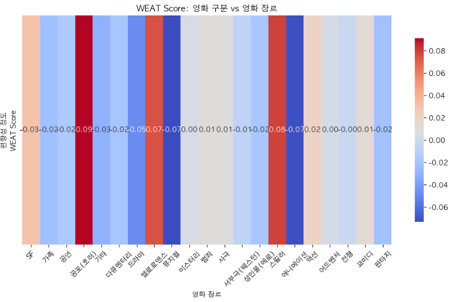
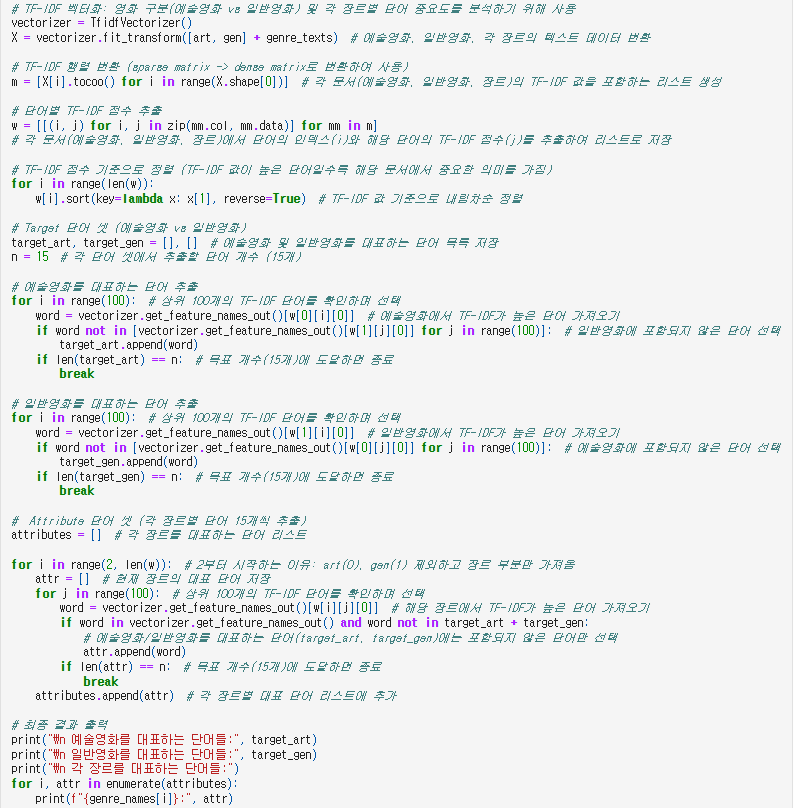
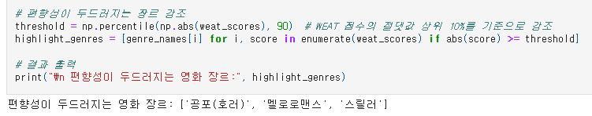
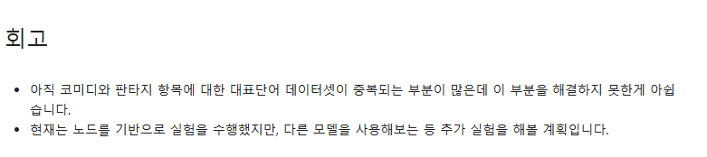
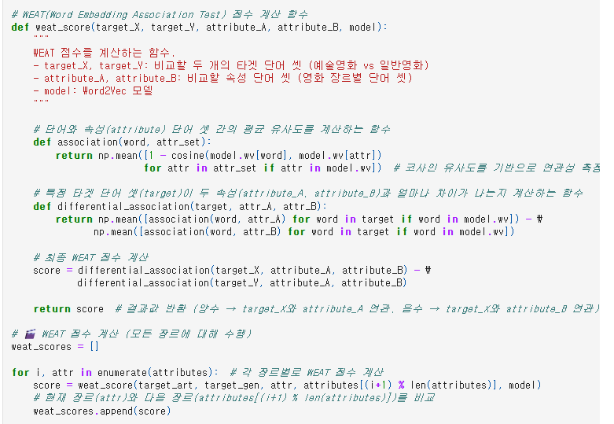

# AIFFEL Campus Online Code Peer Review Templete
- 코더 : 이지안
- 리뷰어 : 염철헌


# PRT(Peer Review Template)
- [X]  **1. 주어진 문제를 해결하는 완성된 코드가 제출되었나요?**
    - 문제에서 요구하는 최종 결과물이 첨부되었는지 확인
        - 중요! 해당 조건을 만족하는 부분을 캡쳐해 근거로 첨부
        - 여러 클래스에 대해 i번째와 i+1번째의 WEAT 스코어를 비교
        - 여러 질문들이 남아있기는 하다. 왜 인접한 클래스만 비교했는지, 스코어 편향이 굉장히 작게 잡혀있다던지.
        - 

- [X]  **2. 전체 코드에서 가장 핵심적이거나 가장 복잡하고 이해하기 어려운 부분에 작성된 
주석 또는 doc string을 보고 해당 코드가 잘 이해되었나요?**
    - 해당 코드 블럭을 왜 핵심적이라고 생각하는지 확인
    - 해당 코드 블럭에 doc string/annotation이 달려 있는지 확인
    - 해당 코드의 기능, 존재 이유, 작동 원리 등을 기술했는지 확인
    - 주석을 보고 코드 이해가 잘 되었는지 확인
        - 중요! 잘 작성되었다고 생각되는 부분을 캡쳐해 근거로 첨부
        - 각 클래스에서 단어를 TF-IDF를 통해서 추출하는 코드는 주석과 함께 이해하기 쉬움
        - 중복 방지는 적용하지 않았으며, 따라서 다른 분들과 비슷하게 다른 클래스에서 동일한 단어들이 대표로 추출되는 현상 발견
        - 
        
- []  **3. 에러가 난 부분을 디버깅하여 문제를 해결한 기록을 남겼거나
새로운 시도 또는 추가 실험을 수행해봤나요?**
    - 문제 원인 및 해결 과정을 잘 기록하였는지 확인
    - 프로젝트 평가 기준에 더해 추가적으로 수행한 나만의 시도, 
    실험이 기록되어 있는지 확인
        - 중요! 잘 작성되었다고 생각되는 부분을 캡쳐해 근거로 첨부
        - 추가 실험은 수행하지 못 하였지만, 피드백 과정에서 WEAT score 히트맵 부분의 보완 필요성을 먼저 언급해주셨음
        - 편향성이 두드러지는 장르 관련하여 기본적으로 편향이 크게 잡혀있지는 않기 때문에 이 부분에 대해서도 설명이 필요할 듯?
        - 
          
- [X]  **4. 회고를 잘 작성했나요?**
    - 주어진 문제를 해결하는 완성된 코드 내지 프로젝트 결과물에 대해
    배운점과 아쉬운점, 느낀점 등이 기록되어 있는지 확인
    - 전체 코드 실행 플로우를 그래프로 그려서 이해를 돕고 있는지 확인
        - 중요! 잘 작성되었다고 생각되는 부분을 캡쳐해 근거로 첨부
        - 실험이 부족함을 인지하고 있고 여러 임베딩 또는 단어추출 기법을 테스트할 예정임을 기록
        - 
          
      
- [X]  **5. 코드가 간결하고 효율적인가요?**
    - 파이썬 스타일 가이드 (PEP8) 를 준수하였는지 확인
    - 코드 중복을 최소화하고 범용적으로 사용할 수 있도록 함수화/모듈화했는지 확인
        - 중요! 잘 작성되었다고 생각되는 부분을 캡쳐해 근거로 첨부
        - WEAT score를 계산하는 함수를 정의하여 간결화함
        - 


# 회고(참고 링크 및 코드 개선)
```
# 많은 주석을 작성하여 각 코드를 알기쉽게 해체해주신 부분에 대해서는 매우 마음에 들었습니다.
# 많은 실험이 이루어지지 못 한 것은 아쉬우나, 전체 코드의 플로우는 알기 쉽고, 또 여러 추가적인 메서드를 도입할 여지가 남아있어 앞으로 더 시도해볼 여지가 남아있다고 생각됩니다.
```
