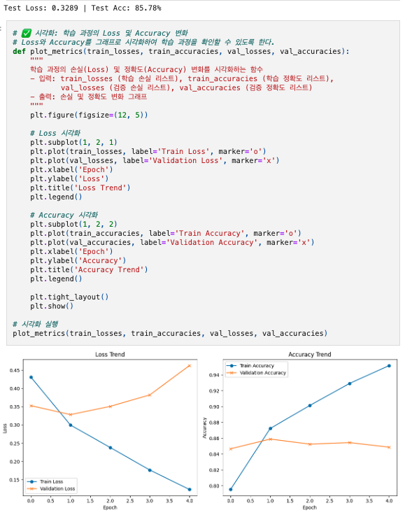
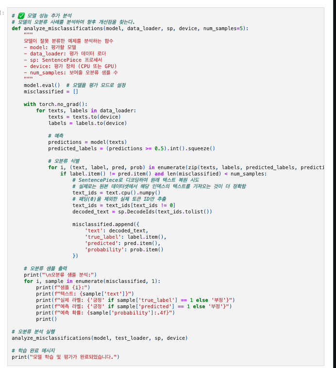
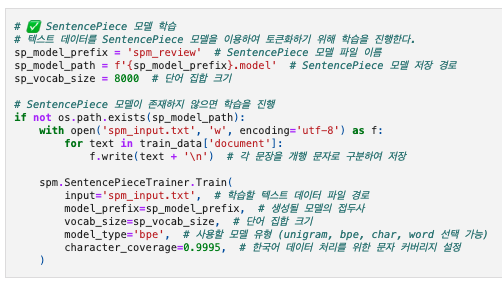
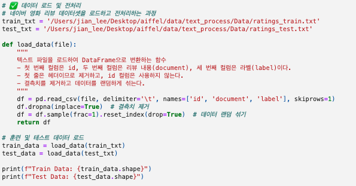
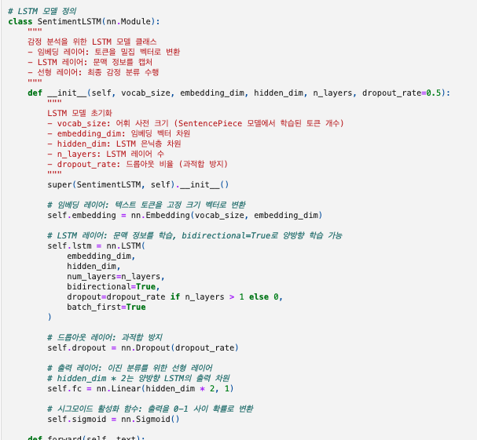

# MainQuest - Quest03
# AIFFEL Campus Online Code Peer Review Templete
- 코더 : 나영진
- 리뷰어 : 이지안


# PRT(Peer Review Template)
- [0]  **1. 주어진 문제를 해결하는 완성된 코드가 제출되었나요?**
    - 문제에서 요구하는 최종 결과물이 첨부되었는지 확인
        - 중요! 해당 조건을 만족하는 부분을 캡쳐해 근거로 첨부
               
            정상적으로 학습하고, 오분류 샘플 분석까지 추가로 잘 진행해 주셨습니다. 

- [0]  **2. 전체 코드에서 가장 핵심적이거나 가장 복잡하고 이해하기 어려운 부분에 작성된 
주석 또는 doc string을 보고 해당 코드가 잘 이해되었나요?**
    - 해당 코드 블럭을 왜 핵심적이라고 생각하는지 확인
    - 해당 코드 블럭에 doc string/annotation이 달려 있는지 확인
    - 해당 코드의 기능, 존재 이유, 작동 원리 등을 기술했는지 확인
    - 주석을 보고 코드 이해가 잘 되었는지 확인
        - 중요! 잘 작성되었다고 생각되는 부분을 캡쳐해 근거로 첨부
               
            오분류 샘플 분석에 대한 설명이 추가로 잘 작성되어 있습니다.

- [0]  **3. 에러가 난 부분을 디버깅하여 문제를 해결한 기록을 남겼거나
새로운 시도 또는 추가 실험을 수행해봤나요?**
    - 문제 원인 및 해결 과정을 잘 기록하였는지 확인
    - 프로젝트 평가 기준에 더해 추가적으로 수행한 나만의 시도, 
    실험이 기록되어 있는지 확인
        - 중요! 잘 작성되었다고 생각되는 부분을 캡쳐해 근거로 첨부
           
            SENTENCEPIECE 하이퍼파라미터 변경을 잘 정리해 주셨습니다.

- [ ]  **4. 회고를 잘 작성했나요?**
    - 주어진 문제를 해결하는 완성된 코드 내지 프로젝트 결과물에 대해
    배운점과 아쉬운점, 느낀점 등이 기록되어 있는지 확인
    - 전체 코드 실행 플로우를 그래프로 그려서 이해를 돕고 있는지 확인
        - 중요! 잘 작성되었다고 생각되는 부분을 캡쳐해 근거로 첨부
               
        전처리에 대해 얘기를 했었는데, 결측치 제거만 하신 이유가 궁금했습니다.
        이러한 부분이나 회고에 대한 내용도 같이 기록되어 있으면 더 좋을것 같습니다. 
        
- [0]  **5. 코드가 간결하고 효율적인가요?**
    - 파이썬 스타일 가이드 (PEP8) 를 준수하였는지 확인
    - 코드 중복을 최소화하고 범용적으로 사용할 수 있도록 함수화/모듈화했는지 확인
        - 중요! 잘 작성되었다고 생각되는 부분을 캡쳐해 근거로 첨부
                
          코드가 잘 작성되어 있습니다.


# 회고(참고 링크 및 코드 개선)
```
# 리뷰어의 회고를 작성합니다.
# 코드 리뷰 시 참고한 링크가 있다면 링크와 간략한 설명을 첨부합니다.
# 코드 리뷰를 통해 개선한 코드가 있다면 코드와 간략한 설명을 첨부합니다.
```
리뷰어 코드에는 문제가 있어 제대로 학습이 안되었는데, 이후 작업 수정 과정에 좋은 참고가 될 것 같습니다.  
시간이 되신다면 파라미터를 변경해 가며 더 많은 실험을 해보시는것도 좋을것 같습니다!  
